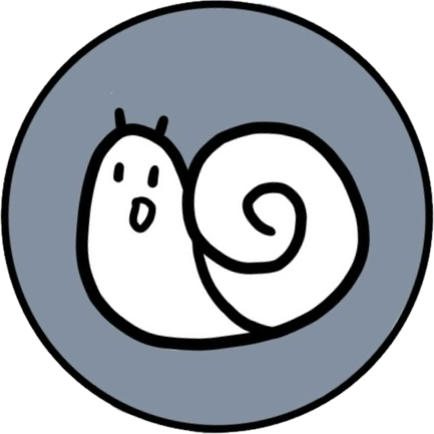

# 글팽이

글팽이는 [글또](https://www.notion.so/zzsza/ac5b18a482fb4df497d4e8257ad4d516)라는 커뮤니티 활동을 돕기 위해 만들어진 슬랙 앱이에요.

아직 특별한 기능은 없지만, 곧 여러가지 기능과 함께 찾아올게요.

신규 기능 업데이트는 이 문서를 통해 확인해주세요.

침착해. 네가 가야할 곳에만 집중해야 해. 다른 달팽이들은 신경쓰지 말고. ([연합뉴스TV](https://youtu.be/6UWWs4CghGc))

### 사용 방법
- 이모지 체크 방법: 누군가를 태그한 메시지 내, 쓰레드로 @글팽이 태그와 함께 '이모지' 혹은 '이모지 확인' 혹은 '이모지 체크' 를 입력해주세요.

### 데모 영상
[태그된 사람이 이모지를 달지 않은 경우]

[태그된 사람이 모두 이모지를 단 경우]

